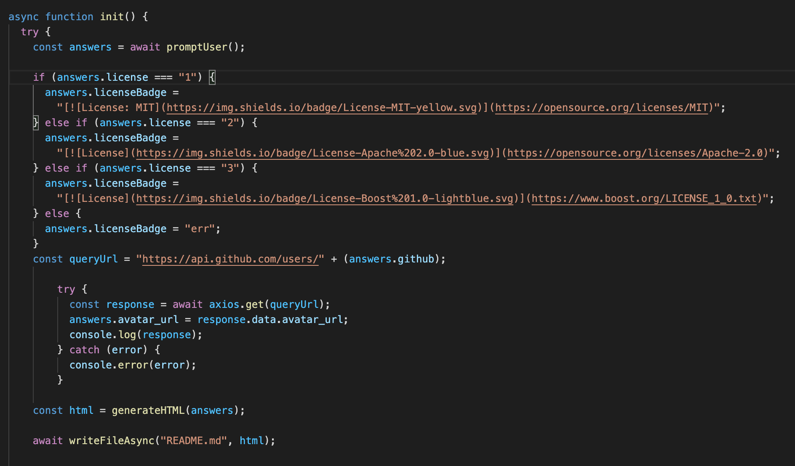

# Readme Generator

## Description

Create a command-line application that dynamically generates a README.md from a user's input. THe application will be invoked with a *node index.js* command and be prompted for GitHub username, email, Project Title, Description, Installation and usage, License, Contributing, Tests, and Questions. 

## Built With

- Javascript
- Axios
- Enquirer
- JSON

## Deployed Link
Here is a YouTube video of the app in action:

https://youtu.be/lebWAA8aPiI

## Code Snippet

Here we have an if Statement that breaks down how the license badge is loaded from the user's choice  and the asynchronous response of axios grabbing the user's GitHub Profile Picture. Enjoy!

## Author

### Ry Hull
 - https://github.com/ryandelonhull
 - https://linkedin.com/in/ryan-hull-94003144

## *Acknowledgments*

Thank you to Roger, Kerwin, Manuel and tutors for wading into the deep waters of Javascript, JSON, Axios, and Enquirer with the class and keeping me afloat with their instruction and guidance. Thank you to my fellow classmates for including me in the study and homework sessions as working together on a problem has been a great teacher also.